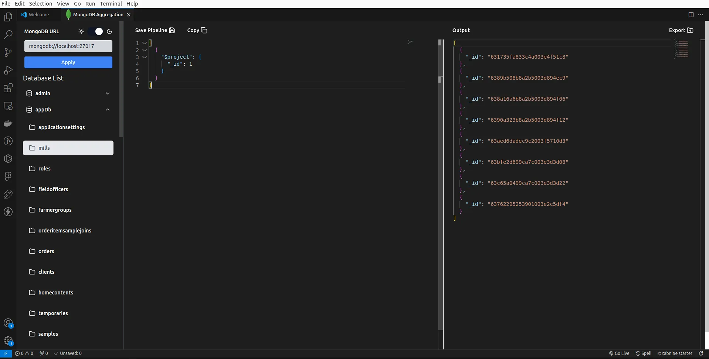
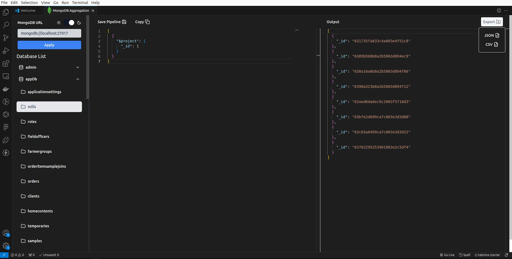
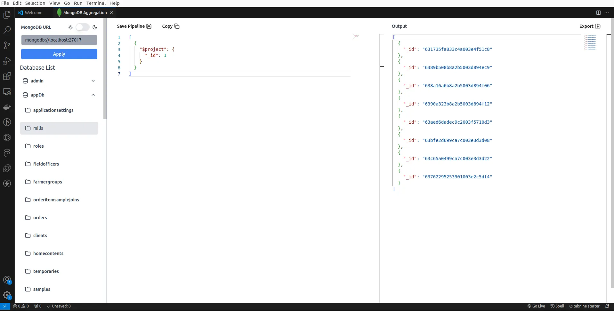

# Mongo Playground VSCode Extension

The Mongo Playground VSCode extension is a tool that allows you to interact with MongoDB databases directly from within Visual Studio Code. It provides a convenient platform for executing MongoDB queries, exploring data, and performing various operations.

## Previews

### Split UI

### Autocompletion and Error Messages

### Light and Dark Theme

## Features

- **Save as much as pipeline you want**: Just save your pipelines on your machine and use theme using the select pipeline selector to use theme.
- **Query and Aggregations Execution**: Run MongoDB queries and aggregations directly from the editor.
- **Data Exploration**: View and analyze MongoDB data in a user-friendly format.
- **Syntax Highlighting**: MongoDB query syntax highlighting for improved readability.
- **Save Pipeline**: Save the pipeline or aggregation pipeline you created.
- **Simple yet powerful UX**: Simply what you need no other extra unnecessary features.
- **Start where you left off**: Just automatically remember where you left off.

## Todo in the future

- **Database Management**: Create, delete, and manage databases and collections.
- **Document Manipulation**: Insert, update, and delete documents in your MongoDB collections.

## Requirements

- An active MongoDB connection.

## Installation

1. Launch Visual Studio Code.
2. Open the Extensions view by clicking on the square icon in the left sidebar or by pressing `Ctrl+Shift+X`.
3. Search for "Mongo Playground" in the Extensions view search bar.
4. Click on the "Install" button next to the Mongo Playground extension.
5. Once installed, click on the "Reload" button to activate the extension.

## Usage

1. Open the Command Palette by pressing Ctrl+Shift+P (Windows/Linux) or Cmd+Shift+P (Mac).
2. Search for and select the "**Mongo Playground**" command and hit **Enter** or **Select it using your mouse** ":)".
3. The extension will connect to the MongoDB server.
4. Write your MongoDB Aggregations in the editor.
5. View the results in the output panel on the right side.
6. Explore and interact with the database the setting panel.

## Configuration

The Mongo Playground extension provides some minimal but needed configuration options that can be customized to suit your specific needs. It provide its own setting for configuration.

For example, you can configure the MongoDB connection settings, theme colors, and database selection and collection name selection and mongodb-url.

## Feedback and Contributions

We welcome your feedback and contributions to the Mongo Playground extension. If you encounter any issues, have suggestions for new features, or would like to contribute to the project, please visit the [GitHub repository](https://github.com/your-repo/mongo-playground) and create an issue or submit a pull request.

## License

The Mongo Playground VSCode extension is released under the [MIT License](https://opensource.org/licenses/MIT). See the [LICENSE](LICENSE) file for more details.

## Support Us To continue on improving mongo-playground

---

We hope you find the Mongo Playground extension useful! If you have any questions or need further assistance, please don't hesitate to reach out.

Happy coding!
